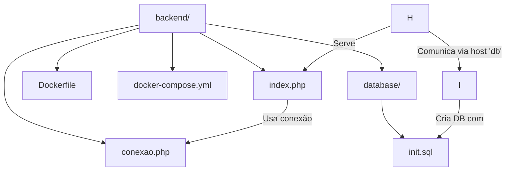

# 📬 Projeto de Comentários com PHP + MySQL

Este projeto é uma aplicação simples em PHP que permite o envio de nome, e-mail e comentário para um banco de dados MySQL. Agora totalmente configurado com Docker e Docker Compose, facilitando a execução local com apenas um comando.

---

## 🚀 Tecnologias Utilizadas

- PHP 8.2 com Apache
- MySQL 5.7
- Docker
- Docker Compose

---

## Imagens 
 


## 📂 Estrutura do Projeto




---

## ⚙️ Pré-requisitos

- [Docker](https://www.docker.com/)
- [Docker Compose](https://docs.docker.com/compose/)

---

## ▶️ Como Executar o Projeto

### 1. Clone o repositório

```bash
git clone https://github.com/Alexdevsoft/k8s-projeto1-app-base/tree/docker-support.git
cd seu-repositorio/backend
```
## Suba os containers com Docker

```bash
    docker-compose up --build
```

## Acesse a aplicação
### Abra o navegador e vá para:
👉 http://localhost:8080

Você pode testar o envio de dados com uma ferramenta como o Postman ou com curl:
```bash
    curl -X POST http://localhost:8080 \
  -d "nome=Alexsandro" \
  -d "email=alex@email.com" \
  -d "comentario=Ótimo projeto!"
```

## 🗄️ Banco de Dados

| Dado           | Valor       |
| -------------- | ----------- |
| Host           | `db`        |
| Porta interna  | `3306`      |
| Porta externa  | `3307`      |
| Usuário        | `root`      |
| Senha          | `Senha123`  |
| Banco de dados | `meubanco`  |
| Tabela criada  | `mensagens` |


### A tabela mensagens é criada automaticamente ao iniciar o container do MySQL usando o script init.sql.

## 💡 Notas

- A comunicação entre os serviços é feita internamente via docker-compose, por isso o host do banco no conexao.php deve ser db.

- O volume persistente garante que os dados do banco não sejam perdidos ao reiniciar os containers.

## 📬 Contribuição

### Sinta-se à vontade para abrir issues ou enviar pull requests com melhorias, correções ou novas funcionalidades.

# 🧑‍💻 Autor: [Alexsandro Almeida](www.linkedin.com/in/alexsandro-j-a-almeida)
## - Desenvolvedor Backend Java
